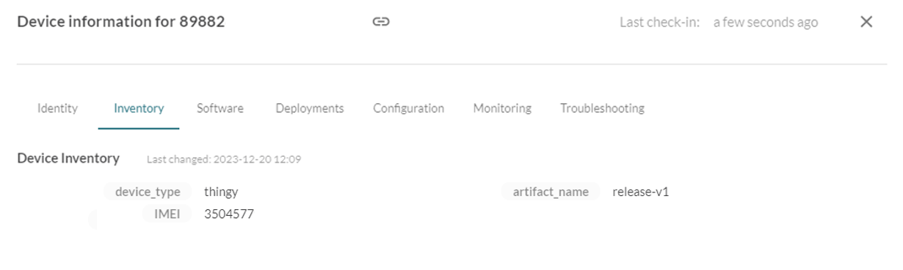
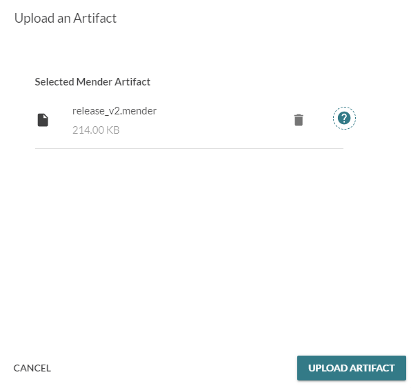
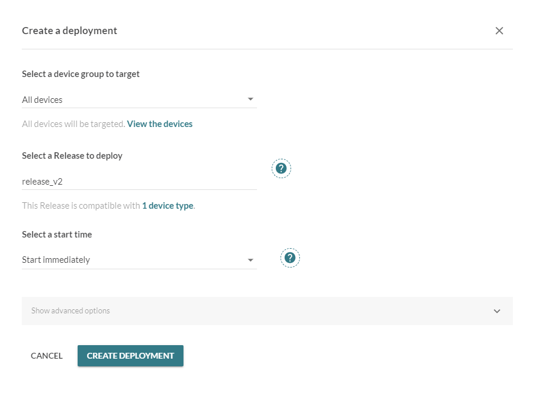
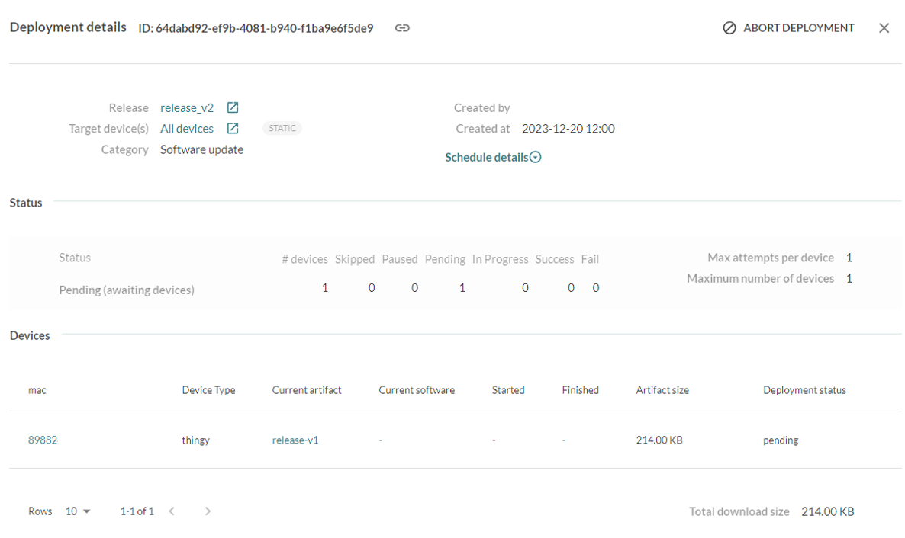
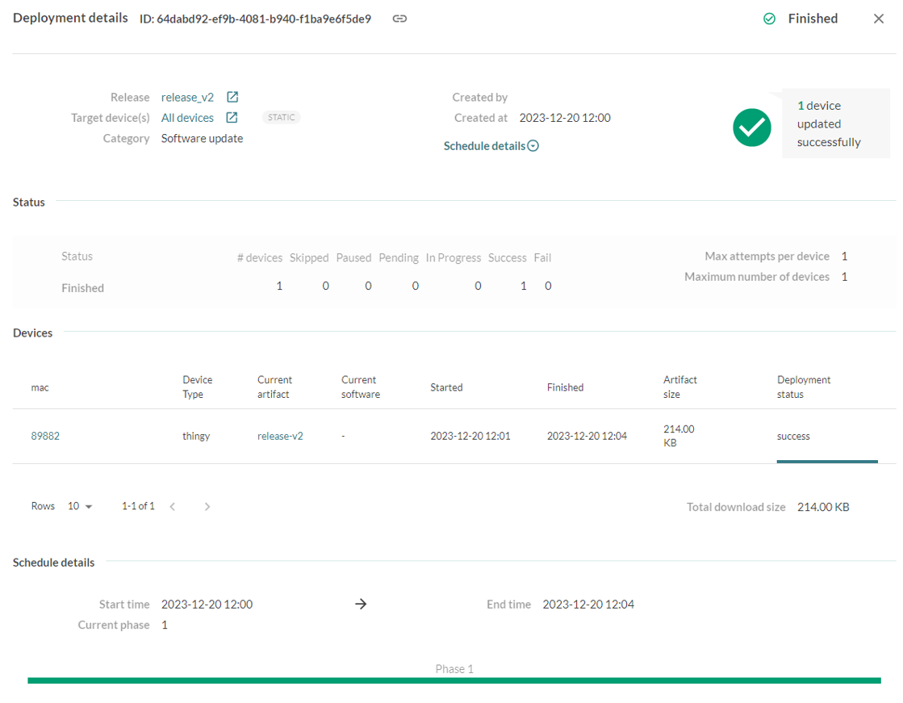

# 1NCE Zephyr blueprint - 1NCE FOTA Mender Demo

## Overview

1NCE FOTA Mender Demo allows customers to update the firmware of their devices using 1NCE Mender plugin.

For `Thingy:91`, the LED colors indicate the following statuses:

- `Flashing white`  the device is  connecting.
- `Green`  the device is on firmware version 1.
- `Flashing Green / Flashing Blue `  the device is downloading the firmware update.
- `Blue`  the device is  on firmware version 2.


To install Mender plugin, follow the instructions in [Mender Plugin dev-hub documentation](https://help.1nce.com/dev-hub/docs/1nce-os-plugins-mender). 

## Running the demo

1. Build the demo for `thingy91_nrf9160_ns` and flash the file `app_signed.hex` to the board using [nRF Connect Programmer](https://infocenter.nordicsemi.com/index.jsp?topic=%2Fug_nc_programmer%2FUG%2Fnrf_connect_programmer%2Fncp_introduction.html). The file is located in the subfolder `zephyr` in the build directory. 

2. When starting the demo for the first time, the device needs to be accepted in Mender dashboard, then it will periodically check for firmware updates, the device inventory is also updated as follows:
<p align="center"><br></p>


3. Change `CONFIG_APPLICATION_VERSION` and `CONFIG_ARTIFACT_NAME` to the new version and rebuild the demo.

4. Create the artifact and use it to create a deployment as described in the following sections


## Artifact Creation

1. Download   [Mender-artifact tool](https://docs.mender.io/downloads#mender-artifact). 

2. Run the following command to create the artifact: (the default DEVICE_TYPE is `thingy`, and the binary file is `app_update.bin` which is located in the subfolder `zephyr` in the build directory). PAYLOAD_TYPE & ARTIFACT_NAME can both be set according to the required version, for example `release-v1`

```
mender-artifact write module-image  -t DEVICE_TYPE  -o FILE_NAME.mender  -T PAYLOAD_TYPE  -n ARTIFACT_NAME  -f BINARY_FILE  --compression none
```


3. Upload the artifact to Mender (in `Releases` page)
<p align="center"><br></p>


## Deployment Creation

1. The deployment can be created as follows:
<p align="center"><br>
</p>


2. It will then be available for the device in the next firmware update check. The deployment status starts as `pending`.
<p align="center"><br>
</p>


3.The device will start downloading the firmware, the staus will change  to `downloading`,`rebooting`, `installing`, and then `success` or `failure`.
<p align="center"><br>
</p>

## Demo Configuration

The configuration options for this sample are:

`CONFIG_APPLICATION_VERSION` the selected application version (1 or 2 for the default demo with LEDs, but new versions can also be defined).

`CONFIG_ARTIFACT_NAME` the artifact name for the selected version.

`CONFIG_MENDER_DEVICE_TYPE` the device type configured in Mender.

`CONFIG_MENDER_FW_UPDATE_CHECK_FREQUENCY_SECONDS` Firmware Update checking frequency.

`CONFIG_MENDER_AUTH_CHECK_FREQUENCY_SECONDS` Authentication status checking frequency,if the device is unauthorized.

`CONFIG_MENDER_URL` the URL of mender server.

`CONFIG_COAP_SERVER_HOSTNAME` is set to 1NCE CoAP proxy.

`CONFIG_COAP_URI_QUERY` set to `mender` .

## Asking for Help

The most effective communication with our team is through GitHub. Simply create a [new issue](https://github.com/1NCE-GmbH/blueprint-zephyr/issues/new/choose) and select from a range of templates covering bug reports, feature requests, documentation issue, or Gerneral Question.