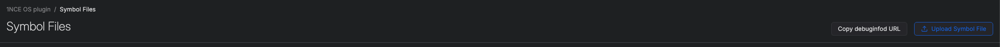
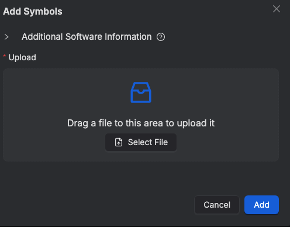
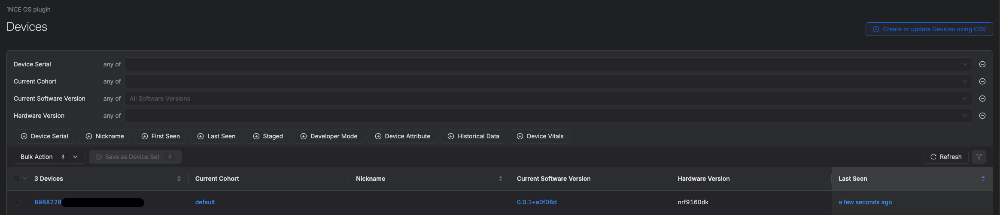
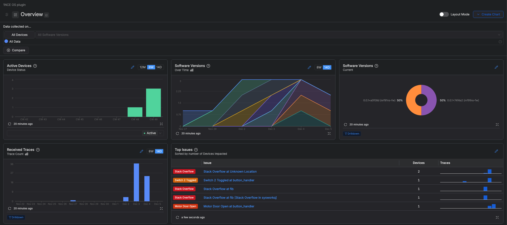
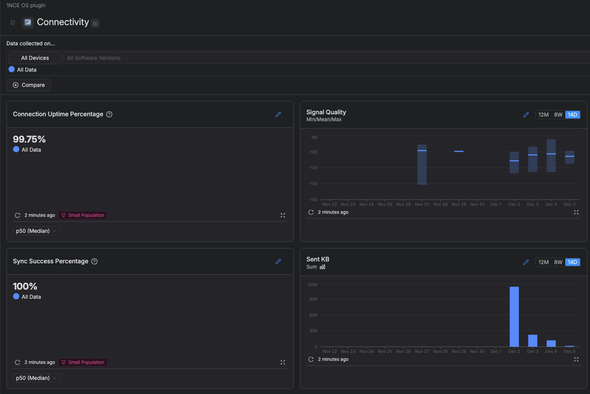
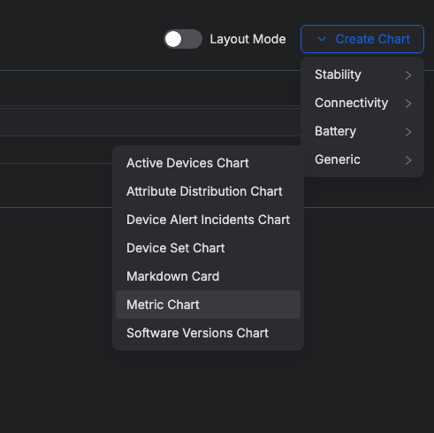
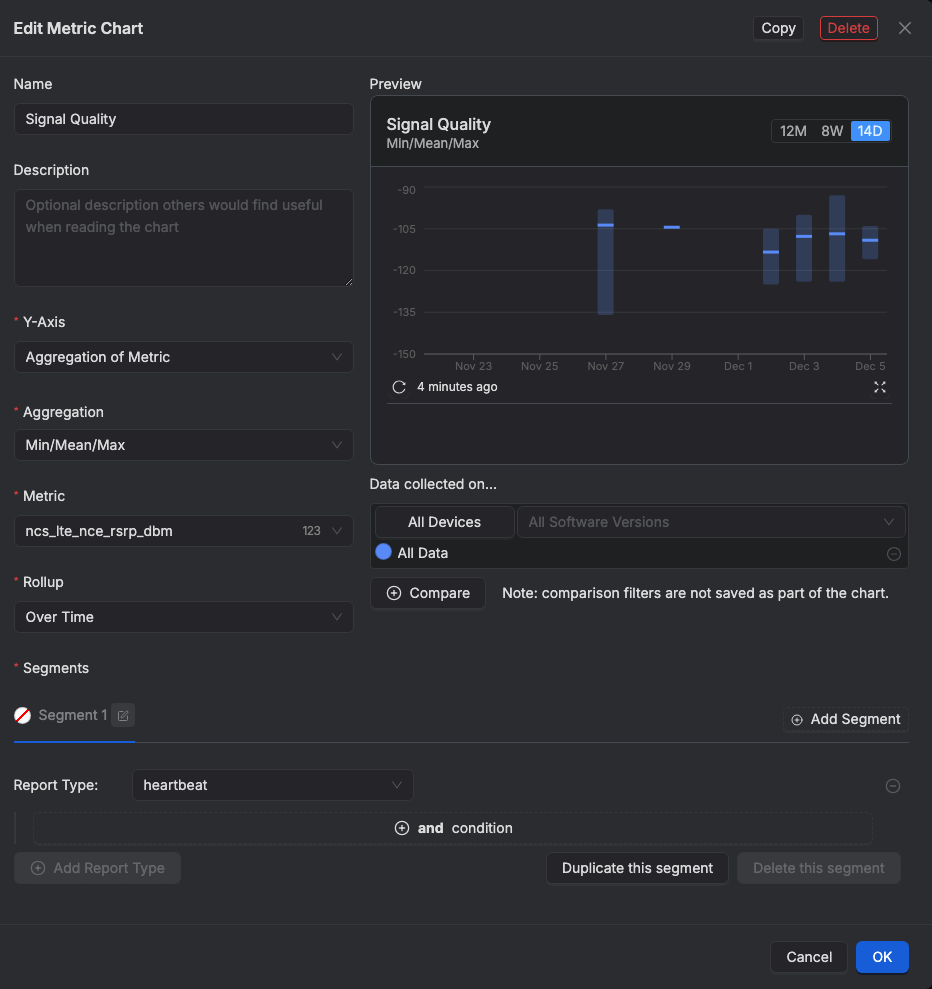
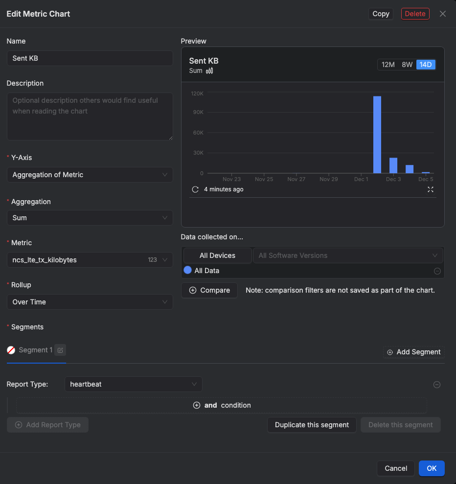

# 1NCE Zephyr blueprint - 1NCE Memfault Demo

## Overview

This demo code showcases how to send Memfault diagnostics data from a Zephyr-based device over CoAP (Constrained Application Protocol) using 1NCE CoAP Proxy. \
This is useful for IoT devices where periodic error reporting and fault diagnostics are critical.\
The communication can be secured using DTLS (Datagram Transport Layer Security) depending on configuration. 

To install Memfault plugin, follow the instructions in [Memfault Plugin dev-hub documentation](https://help.1nce.com/dev-hub/docs/1nce-os-plugins-device-observability-memfault). 

This demo requires [nRF Connect SDK (v2.8.0)](https://docs.nordicsemi.com/bundle/ncs-2.8.0/page/nrf/gsg_guides.html)

For `Thingy:91`, the LED colors are used to indicate the following:

- `BLUE:` A network connection has been successfully established.
- `GREEN:` Memfault data was successfully sent via the 1NCE CoAP Proxy.
- `RED:` Failed to send Memfault data.

## Running the demo

1. Build the demo for `nrf9160dk_nrf9160_ns` or  `thingy91_nrf9160_ns`   and flash it.
* Note: On Windows, file path length limitations may cause errors during the build process. To resolve this, consider moving the demo folder to a directory with a shorter path (e.g., `C:\dev`).
* For  `nrf9160dk_nrf9160_ns`, the demo can be flashed directly from VS code using the "Flash" option in nrf Connect tab.
* For `thingy91_nrf9160_ns`, the file `build/nce_debug_memfault_demo/zephyr/zephyr.signed.hex` should be flashed using the programmer app from [nrf Connect for Desktop](https://www.nordicsemi.com/Products/Development-tools/nRF-Connect-for-Desktop).

2. Upload the symbol file `build/nce_debug_memfault_demo/zephyr/zephyr.elf` to Memfault (Symbol files tab > Upload symbol file). This file is required by Memfault to process the metrics sent from the device. For more information about symbol files, refer to the documentation [here](https://docs.memfault.com/docs/mcu/symbol-file-build-ids).
<p align="center"><br></p>
<p align="center"><br></p>

2. When starting the demo for the first time, a new device will appear in Memfault UI, the device serial is set to ICCID of the SIM by default.
<p align="center"><br></p>

3. Two events will be sent by the device on boot, a heartbeat event containg predefined metrics, and a reboot event including the reboot cause.

4. [Memfault Zephyr CLI](https://docs.memfault.com/docs/mcu/demo-cli-cmds-ncs-zephyr#command-reference) can be used to generate test events.

5. The Demo also contains the following additional commands:
```
nce post_chunks     : Post Memfault data to cloud via 1NCE CoAP Proxy
nce divby0          : Trigger Division by zero
nce sw1             : Increment switch_1_toggle_count
nce sw2             : Trigger switch_2_toggled event
nce disconnect      : Simulates a network disconnection and reconnection sequence
```
The overview dashboard shows a summary of recent device issues:
<p align="center"><br></p>

## Fault Injection via Buttons

Memfault uses buttons and switches on the board to demonstrate the following:
`Button 1`: Triggers a stack overflow.

`Button 2`: Triggers division by zero.

`Switch 1`: Increments a custom metric (switch_1_toggle_count).

`Switch 2`: Logs and traces a toggle event (switch_2_toggled).

Note: for `Thingy:91`, only `Button 1` is available, other actions can be simulated using `nce` cli commands.

## Connectivity Metrics

Connectivity metrics collected by Memfault include:
- `ncs_lte_time_to_connect_ms`: Time taken from starting the LTE search to network registration.
- `ncs_lte_connection_loss_count`: Number of LTE connection losses after initial registration.
- `ncs_lte_tx_kilobytes`: Amount of data sent (in KB).
- `ncs_lte_rx_kilobytes`: Amount of data received (in KB).

Enabled (by default) with:
```
CONFIG_MEMFAULT_NCS_LTE_METRICS=y
```
In addition, sync metrics include:
- `sync_memfault_successful`: Count of successful Memfault sync attempts.
- `sync_memfault_failure`: Count of failed Memfault sync attempts.

Enabled (by default) with: 
```
CONFIG_NCE_MEMFAULT_DEMO_COAP_SYNC_METRICS=y
```

The demo also adds the following connectivity metrics:
- `ncs_lte_nce_operator`: LTE operator code (MCC and MNC).
- `ncs_lte_nce_bands`: Supported LTE bands.
- `ncs_lte_nce_current_band`: Current LTE band.
- `ncs_lte_nce_apn`: APN (Access Point Name).
- `ncs_lte_nce_rsrp_dbm`: LTE RSRP (Signal strength).

Enabled (by default) with:
```
CONFIG_NCE_MEMFAULT_DEMO_CONNECTIVITY_METRICS=y
```
### Sample Connectivity dashboard configuration:
<p align="center"><br></p>

#### Sync Succes chart configuration:
<p align="center"><br></p>

#### To create a new metrics chart:
<p align="center"><br></p>

#### Signal quality chart configuration:
<p align="center"><br></p>

#### Sent KB chart configuration:
<p align="center"><br></p>

## DTLS Configuration

To enable DTLS, add the following configuration:
```
CONFIG_NCE_MEMFAULT_DEMO_ENABLE_DTLS=y
CONFIG_NCE_SDK_ENABLE_DTLS=y
CONFIG_NCE_DEVICE_AUTHENTICATOR=y
CONFIG_NCE_SDK_DTLS_SECURITY_TAG=<security_tag>
```
- `CONFIG_NCE_SDK_DTLS_SECURITY_TAG` defines a secure modem storage slot for saving the PSK persistently, ensuring it remains available across device reboots.
- If the device is previously onboarded, `CONFIG_NCE_SDK_DTLS_SECURITY_TAG` can be set to the tag that was used for onboarding.
- If not, `CONFIG_NCE_SDK_DTLS_SECURITY_TAG` should be set to an empty tag. The demo will then use 1NCE Device Authenticator ( `os_auth()` function from the SDK ) to onboard the device.
- If DTLS connection fails three times due to an invalid PSK, the device will reinitiate onboarding to update the PSK.

## Demo Configuration

The configuration options for this sample are:

`CONFIG_NCE_MEMFAULT_DEMO_PERIODIC_UPDATE` Enable periodic Memfault updates.
- Note: If periodic updates are disabled, the RAM buffer used to store events may fill up unless the  chunks are uploaded manually. By default, the buffer size is 1024 bytes, and it can be adjusted using the `CONFIG_MEMFAULT_EVENT_STORAGE_SIZE`.

`CONFIG_NCE_MEMFAULT_DEMO_PERIODIC_UPDATE_FREQUENCY_SECONDS` Update frequency (in seconds).

The heartbeat collection interval can be configured using `MEMFAULT_METRICS_HEARTBEAT_INTERVAL_SECS`  in `config/memfault_platform_config.h`

`CONFIG_NCE_MEMFAULT_DEMO_CONNECTIVITY_METRICS` Collect Additional connectivity metrics.

`CONFIG_NCE_MEMFAULT_DEMO_COAP_SYNC_METRICS` Enable sync success/failure metrics.

`CONFIG_NCE_MEMFAULT_DEMO_PRINT_HEARTBEAT_METRICS` Print the collected heartbeat metrics.

`CONFIG_NCE_MEMFAULT_DEMO_DISCONNECT_DURATION_SECONDS` Disconnect command duration (in seconds).

`CONFIG_NCE_MEMFAULT_DEMO_ENABLE_DTLS` Enable DTLS for CoAP Proxy communication.

## Asking for Help

The most effective communication with our team is through GitHub. Simply create a [new issue](https://github.com/1NCE-GmbH/blueprint-zephyr/issues/new/choose) and select from a range of templates covering bug reports, feature requests, documentation issue, or Gerneral Question.

